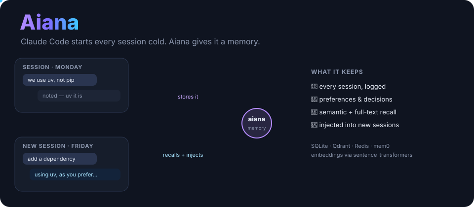
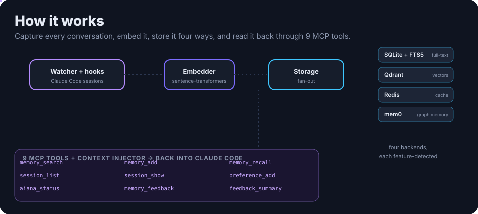

<p align="center">
  
</p>

<h1 align="center">Aiana</h1>

<p align="center"><b>A memory for Claude Code.</b> Aiana watches your sessions, remembers what happened, and feeds it back into new ones — so every session builds on the last instead of starting cold. 100% local.</p>

<p align="center">
  
  <a href="https://www.python.org/downloads/"></a>
  
  
  <a href="LICENSE"></a>
</p>

---

## The idea

```
Without aiana:  session → do work → forget
With aiana:     session → do work → remember → recall → compound
```

Your preferences persist, your decisions are kept, and Claude Code learns the way *you* work — all on your own machine.

## How it works

<p align="center">
  
</p>

- **Capture** — Claude Code's official hooks (and a Docker-friendly file watcher) record each session.
- **Embed** — `sentence-transformers` (all-MiniLM-L6-v2) turns text into vectors.
- **Store, four ways** — SQLite + FTS5 for full-text, Qdrant for semantic search, Redis for cache, and mem0 for extracted/deduplicated memory. Each backend is feature-detected; missing ones are skipped.
- **Recall** — a context injector adds relevant memory at session start, and 9 MCP tools let Claude search and add memory on demand.

## The 9 MCP tools

| | |
|---|---|
| `memory_search` · `memory_recall` | find memory by meaning or pull context for a project |
| `memory_add` · `preference_add` | add a memory or a persistent preference |
| `session_list` · `session_show` | browse recorded sessions |
| `aiana_status` | health of the backends |
| `memory_feedback` · `feedback_summary` | rate recalled memory and review the signal |

## Quick start

**Docker (full stack: aiana + Redis + Qdrant):**

```bash
git clone https://github.com/ry-ops/aiana && cd aiana
docker compose up -d
docker compose exec aiana aiana status
docker compose exec aiana aiana memory search "authentication"
```

**Local:**

```bash
pip install -e ".[all]"   # or ".": minimal
aiana install             # install Claude Code hooks + load preferences
aiana start               # start monitoring
```

<details>
<summary><b>Everyday CLI</b></summary>

```bash
aiana session list                 # recent sessions
aiana memory search "topic"        # semantic search
aiana memory recall "project"      # pull context for a project
aiana preference add "..."         # persistent preference
aiana status                       # backend health
```
</details>

**As an MCP server** — point your client at `aiana-mcp` (installed by the package) to expose the 9 tools directly to Claude.

## Privacy

Everything stays on your machine: local storage, no cloud sync, and Docker mounts your Claude data **read-only**. Nothing leaves your system.

## Docs

Architecture, storage, context injection, the MCP server and the Claude Code internals it relies on are documented in [`docs/`](docs/).

## License

MIT. See [LICENSE](LICENSE).

<!-- org-footer -->
---

<p align="center"><sub>Part of <a href="https://github.com/ry-ops">ry-ops</a> · building the pipes between infrastructure, automation, and observability · built by <a href="https://github.com/ry-ops">ry-ops</a></sub></p>
