# Aiana

**Personal AI Operations Memory for Claude Code**

Aiana transforms Claude Code from stateless sessions into a compound learning system. It captures conversations, embeds them as vectors, and injects relevant context at session start—so your AI assistant remembers YOUR patterns.

<p align="center">
  
</p>

## The Vision

```
Traditional: Sessions → Do tasks → Forget
With Aiana:  Sessions → Do tasks → Remember → Improve → Compound
```

Every session makes future sessions better. Your workflows get encoded. Your preferences persist. Claude learns YOUR way of working.

---

## Architecture

```mermaid
flowchart TB
    subgraph CC["🖥️ Claude Code"]
        sessions["Sessions & Conversations"]
    end

    subgraph AIANA["🧠 AIANA - Memory Layer"]
        direction TB
        capture["📥 Session Capture"]
        embed["🔢 Embedding Engine<br/><i>all-MiniLM-L6-v2</i>"]
        inject["💉 Context Injector"]
        mcp["🔌 MCP Server"]
    end

    subgraph STORAGE["💾 Storage Backends"]
        direction LR
        sqlite[("📄 SQLite<br/>FTS5 Full-Text")]
        redis[("⚡ Redis<br/>Session Cache")]
        qdrant[("🔮 Qdrant<br/>Vector Search")]
    end

    CC -->|"hooks API"| capture
    capture --> embed
    embed --> sqlite
    embed --> redis
    embed --> qdrant

    sqlite --> inject
    redis --> inject
    qdrant --> inject

    inject -->|"context block"| CC
    mcp <-->|"tools"| CC

    style AIANA fill:#7C3AED,color:#fff
    style CC fill:#D97706,color:#fff
    style sqlite fill:#0EA5E9,color:#fff
    style redis fill:#DC2626,color:#fff
    style qdrant fill:#059669,color:#fff
```



---

## Features

### Storage & Search
- **SQLite with FTS5** - Session transcripts, full-text search
- **Redis caching** - Fast session state, context cache, preferences
- **Qdrant vectors** - Semantic search via sentence-transformers

### Intelligence
- **Context injection** - Auto-inject relevant memories at session start
- **User preferences** - Persistent (static) and recent (dynamic) prefs
- **Semantic search** - Find memories by meaning, not just keywords

### Integration
- **MCP server mode** - Expose memory tools directly to Claude
- **Hook-based capture** - Official Claude Code hooks API
- **File watcher** - Docker-compatible monitoring mode

### Privacy
- **100% local** - All data stays on your machine
- **No cloud sync** - Nothing leaves your system
- **Read-only mounts** - Docker uses read-only access to Claude data

---

## Quick Start

### Docker Compose (Recommended)

```bash
# Clone repository
git clone https://github.com/ry-ops/aiana
cd aiana

# Start full stack (Aiana + Redis + Qdrant)
docker compose up -d

# Check status
docker compose exec aiana aiana status

# Search memories
docker compose exec aiana aiana memory search "authentication"
```

### Local Installation

```bash
# Install with all features
pip install -e ".[all]"

# Or minimal install
pip install -e .

# Install Claude Code hooks
aiana install

# Start monitoring
aiana start
```

---

## CLI Commands

### Session Management

```bash
# List recent sessions
aiana list --limit 10

# View a session
aiana show <session-id>

# Search full-text
aiana search "database migration"

# Export session
aiana export <session-id> --format markdown
```

### Memory Operations

```bash
# Semantic search
aiana memory search "how did I fix the auth bug"

# Add a memory manually
aiana memory add "cortex uses uv for Python deps" --type pattern

# Recall context for a project
aiana memory recall git-steer
```

### Preferences

```bash
# Add permanent preference
aiana prefer "Uses conventional commits"

# Add temporary/recent context
aiana prefer "Working on Aiana docs" --temporary
```

### MCP Server

```bash
# Start MCP server
aiana mcp

# Check system status
aiana status
```

---

## MCP Server Tools

When running as an MCP server, Aiana exposes these tools to Claude:

| Tool | Description |
|------|-------------|
| `memory_search` | Semantic search across memories |
| `memory_add` | Save a memory or note |
| `memory_recall` | Get context for a project |
| `session_list` | List recorded sessions |
| `session_show` | View session details |
| `preference_add` | Add user preferences |
| `aiana_status` | System health check |

### Claude Desktop Integration

```json
{
  "mcpServers": {
    "aiana": {
      "command": "aiana",
      "args": ["mcp"]
    }
  }
}
```

---

## Docker Configuration

### Full Stack (docker-compose.yml)

```yaml
services:
  aiana:
    image: ry-ops/aiana:latest
    depends_on:
      - redis
      - qdrant
    volumes:
      - ~/.claude:/home/aiana/.claude:ro
      - aiana-data:/home/aiana/.aiana
    ports:
      - "8765:8765"  # MCP server
    environment:
      - REDIS_URL=redis://redis:6379
      - QDRANT_URL=http://qdrant:6333

  redis:
    image: redis:7-alpine
    command: redis-server --appendonly yes

  qdrant:
    image: qdrant/qdrant:latest
    volumes:
      - qdrant-data:/qdrant/storage

volumes:
  aiana-data:
  qdrant-data:
```

### Environment Variables

| Variable | Description | Default |
|----------|-------------|---------|
| `TZ` | Timezone | `UTC` |
| `REDIS_URL` | Redis connection URL | `redis://localhost:6379` |
| `QDRANT_URL` | Qdrant server URL | `http://localhost:6333` |
| `AIANA_MCP_PORT` | MCP server port | `8765` |
| `AIANA_EMBEDDING_MODEL` | Embedding model | `all-MiniLM-L6-v2` |

---

## Configuration

Configuration file: `~/.aiana/config.yaml`

```yaml
storage:
  type: sqlite
  path: ~/.aiana/conversations.db

recording:
  include_tool_results: true
  include_thinking: false
  redact_secrets: true

retention:
  days: 90
  max_sessions: 1000

privacy:
  encrypt_at_rest: false
```

---

## How Context Injection Works

On every `SessionStart`, Aiana:

1. **Loads your profile** - Static preferences you've saved
2. **Fetches project context** - Recent work in this project
3. **Searches semantically** - Finds relevant memories
4. **Injects context** - Adds `<aiana-context>` block

```xml
<aiana-context>
## User Preferences (Persistent)
- Prefers TypeScript over JavaScript
- Uses ESLint flat config (v9+)
- Commits with conventional format

## Project: git-steer
### Recent Activity
- Fixed 9 security vulnerabilities
- Updated to vitest 4.x
- Created blog post series

## Recent Context
- Working on Aiana documentation
</aiana-context>
```

Claude sees this context and adapts to YOUR patterns.

---

## Documentation

- [Architecture](docs/ARCHITECTURE.md) - Technical design and components
- [Storage Backends](docs/STORAGE.md) - SQLite, Redis, Qdrant configuration
- [MCP Server](docs/MCP_SERVER.md) - MCP integration and tools
- [Context Injection](docs/CONTEXT_INJECTION.md) - How memory injection works
- [Claude Code Internals](docs/CLAUDE_CODE_INTERNALS.md) - File formats, hooks, APIs
- [TOS Compatibility](docs/TOS_COMPATIBILITY_ANALYSIS.md) - Legal compliance

---

## Privacy & Security

Aiana is designed with privacy as a core principle:

- **Local Only** - All data stored on your machine
- **No Cloud Sync** - Data never leaves your system
- **User Control** - You decide what gets recorded
- **Read-Only Access** - Docker mounts Claude directory as read-only
- **Non-Root Container** - Runs as unprivileged user

---

## Roadmap

- [x] **Phase 1: Core MVP**
  - [x] Hook-based session capture
  - [x] SQLite storage with FTS5
  - [x] CLI interface
  - [x] Docker support

- [x] **Phase 2: Memory Layer**
  - [x] Redis caching
  - [x] Qdrant vector storage
  - [x] Semantic search
  - [x] Context injection
  - [x] MCP server mode

- [ ] **Phase 3: Intelligence**
  - [ ] Automatic pattern extraction
  - [ ] Session summaries
  - [ ] Cross-session linking
  - [ ] Workflow suggestions

- [ ] **Phase 4: Polish**
  - [ ] Secret redaction
  - [ ] Encryption at rest
  - [ ] Web UI (optional)

---

## Related Projects

**ry-ops ecosystem:**
- [git-steer](https://github.com/ry-ops/git-steer) - GitHub autonomy engine via MCP
- [cortex](https://github.com/ry-ops/cortex) - Multi-agent AI system

**Community tools:**
- [ccusage](https://github.com/ryoppippi/ccusage) - Cost/token tracking
- [claude-code-log](https://github.com/daaain/claude-code-log) - JSONL to HTML converter

---

## Contributing

Contributions welcome! Please read the documentation and open an issue before submitting PRs.

## License

MIT License - see [LICENSE](LICENSE) file for details.

---

**Repository:** [github.com/ry-ops/aiana](https://github.com/ry-ops/aiana)

**Blog Post:** [Personal AI Operations Memory](https://ry-ops.dev/posts/2026-02-01-personal-ai-operations-memory)

**Status:** Phase 2 Complete - Memory Layer Ready

**Version:** [v1.0.0.1](https://github.com/ry-ops/aiana/releases/tag/v1.0.0.1)

**Updated:** 2026-02-02
